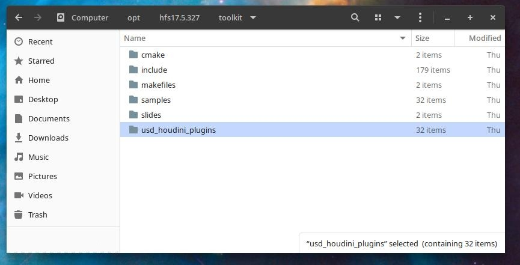
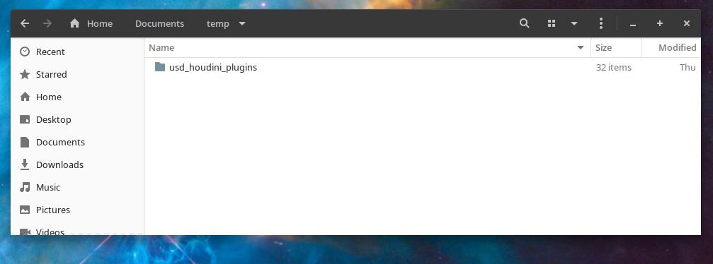
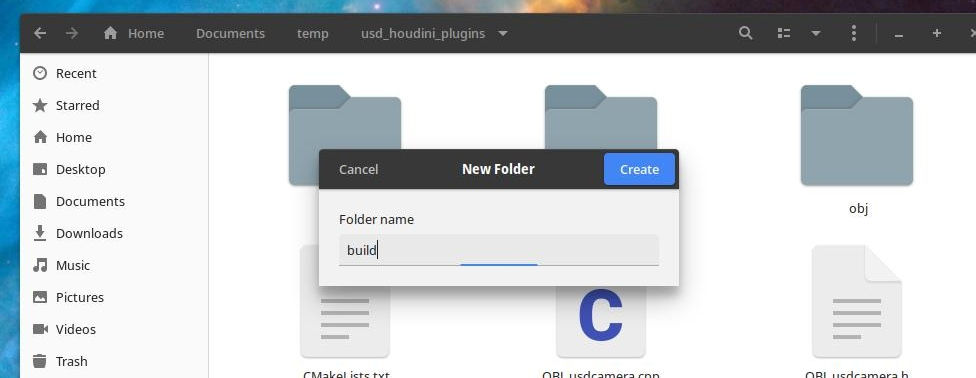
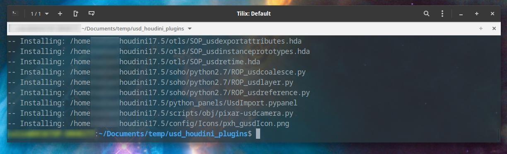
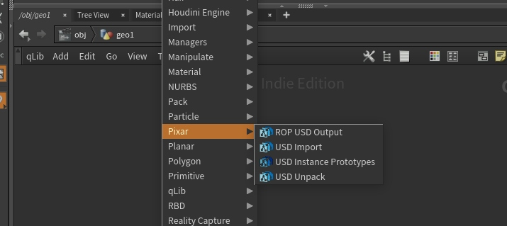

+++
author = "Jakub Vondra"
title = "Compiling Houdini USD plugins on Linux"
date = "2019-07-31"
description = "A guide on compiling Houdini USD plugins on Linux"
tags = [
    "Houdini",
    "USD",
]
categories = [
    "guides",
    "tutorials",
]
series = ["Themes Guide"]
aliases = ["migrate-from-jekyl"]
image = "teaser.jpg"
+++
## USD
For more info about what is USD and why it could interest you, check here: 
[Pixar USD page](https://graphics.pixar.com/usd/docs/Introduction-to-USD.html) 
[SideFX's USD-based SOLARIS project.](https://youtu.be/emcT5qXdUsc)  

Since version 17 Houdini comes with USD plugins. There is a catch though, you have to compile them yourself.  
There is [a video from Rachid Abderrahmane.](https://www.sidefx.com/tutorials/compiling-usd-plugins-for-houdini-windows-10/) on compiling the plugins on Windows. 
Even though compiling the plugins on Linux is much more simple, this could save someone a couple minutes. 

## Steps
I'm using popOS which is based on Ubuntu. On other linux distros the commands migth slightly differ.  

Start by installing cmake in terminal: 

sudo apt install cmake


Let's say you have Houdini installed in /opt/hfs17.5.173/ 
Under folder toolkit there is <i>usd_houdini_plugins</i> folder. 
 
Copy that folder to e.g. <i>home/YOUR_USER/Documents/temp/</i>  (to avoid problem with user premissions) 
 

Make folder called <i>build</i> under the <i>usd_houdini_plugins folder.</i> 
 
 
in terminal cd to this folder:

cd /home/YOUR_USER/Documents/temp/usd_houdini_plugins


export CMAKE_PREFIX_PATH variable:

export CMAKE_PREFIX_PATH="/opt/hfs17.5.173/toolkit/cmake"


Build the plugins:

cmake /opt/hfs17.5.173/toolkit/usd_houdini_plugins


And install:

make -j8 install


If everything went ok, then after starting Houdini you should be able to create USD nodes.
For more info about how to use them go to [USD Houdini documentation](https://graphics.pixar.com/usd/docs/A-Tour-of-USD-Houdini-Primitives.html)  

