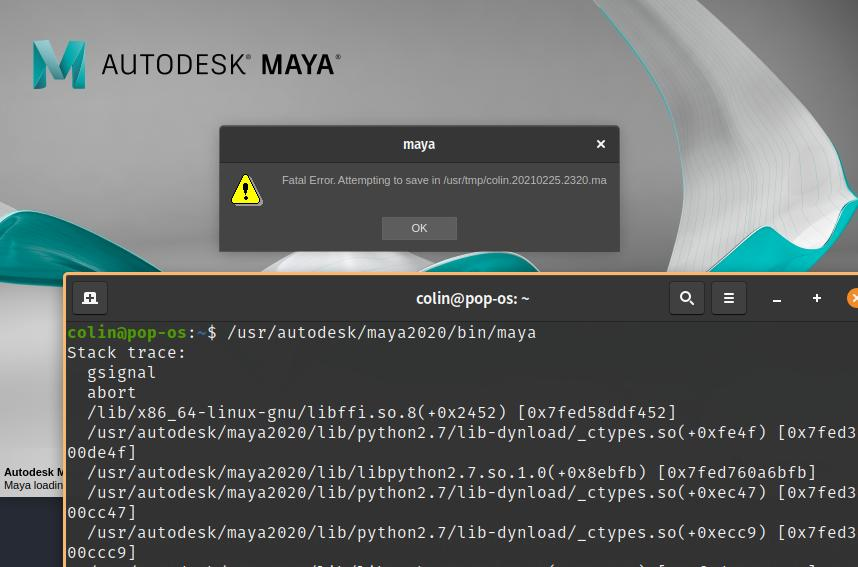

+++
author = "Jakub Vondra"
title = "Installing Maya On Pop!OS and Ubuntu 20.10"
date = "2020-02-25"
description = "A guide on installing Maya On Pop!OS and Ubuntu 20.10"
tags = [
    "Maya",
    "Linux",
    "Pop!OS",
    "Guide",
]
categories = [
    "guides",
    "tutorials",
]
series = ["Themes Guide"]
aliases = ["migrate-from-jekyl"]
image = "error.jpg"
+++

I've recently spent some time trying to make Maya 2020 work on PopOS 20.10. I was helping a friend, luckily I have no use for Maya myself anymore.
But since this might be helpful for someone, I thought I'd share.  
I was using PopOS but all the steps except the last one should apply to ubuntu 20.10 too.  

  

Autodesk provides a
[GUIDE](https://knowledge.autodesk.com/support/maya/learn-explore/caas/simplecontent/content/installing-maya-2020-ubuntu.html)  for installing Maya 2020 on Ubuntu 20.04  
Most of the steps are still valid so I will just point out what I did differently. 
  

## Different steps

### Step 2  
Since *libXp6* in *ppa:zeehio/libxp* is no longer being updated, I've downloaded and manually installed the  *libxp - 1:1.0.2-2ubuntu1~20.04*  package from [HERE](https://launchpad.net/~zeehio/+archive/ubuntu/libxp/+packages)  
### Step 6  
I used command *sudo dpkg -i xxx.deb* instead of *sudo apt-get install ./xxx.deb*

### Step 8  
I used command *sudo dpkg -i xxx.deb* instead of *sudo apt-get install ./xxx.deb*

### Step 11  
folder **\~/tmp** probably doesn't exist on your system so create it or just use some that exists. 

### When you try to run Maya at the end, you'll likely get some errors.

## Resolving Errors when starting Maya  
First some Usefull comands 
Show which libraries Maya is picking up:

ldd /usr/autodesk/maya2020/bin/maya.bin

Crash logs: (scroll down)

gedit /var/log/kern.log


### If you get "hash md5 was not found"

cd /usr/autodesk/maya2020/lib/python2.7/lib-dynload
sudo mv _hashlib.so rhel_hashlib.so
sudo cp /usr/autodesk/maya2020/support/python/2.7.11/ubuntu_hashlib.so _hashlib.so
sudo cp /usr/lib/python2.7/lib-dynload/_hashlib.x86_64-linux-gnu.so _hashlib.so

### If you get "libtbb_preview.so.2 not found"

sudo ln -s /usr/lib/x86_64-linux-gnu/libtbb.so.2 /usr/lib/x86_64-linux-gnu/libtbb_preview.so.2


### If you get libssl errors

sudo ln -sf /opt/Autodesk/Adlm/R17/lib64/libssl.so.1.0.0 /usr/autodesk/maya2020/lib/libssl.so.10
sudo ln -sf /opt/Autodesk/Adlm/R17/lib64/libcrypto.so.1.0.2 /usr/autodesk/maya2020/lib/libcrypto.so.1.0.2


### If you get libffi.so.8 error 
This one was the hardest to crack.
libffi was updated since 20.04 and Maya hates the new version.

  

The solution is to get the older version of this library: *libffi.so.7.1.0* and force it to Maya by using:

export LD_PRELOAD="/pathToTheLibrary/libffi.so.7.1.0"

in terminal before running maya by:

/usr/autodesk/maya2020/bin/maya


To get this library on PopOS I just installed the .deb from [ubuntuupdates.org](https://www.ubuntuupdates.org/pm/libffi-dev)
I installed the version for focal (downagrading) and then installed the groovy (upgrading back again)
That gave me the 7.1.0 version in /usr/lib/x86_64-linux-gnu/, without messing up my system too much.
Then I could just run 

export LD_PRELOAD="/usr/lib/x86_64-linux-gnu/libffi.so.7.1.0"
/usr/autodesk/maya2020/bin/maya


On bare Ubuntu its a bit more complicated because it doesn't let you downgrade the package so easily, but try searching your system for *libffi.so.7.1.0*, you probably have it as part of some app somewhere, in which case try to force the path to it with LD_PRELOAD.

You will have to use LD_PRELOAD every time before running Maya, so it migh be good creting some imple .sh script for that.

Hope that helps

Cheers